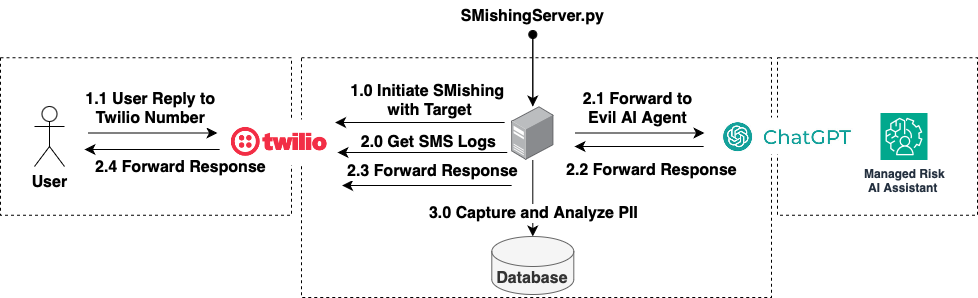

# GenAISmishing
Operationalization of chatGPT to perform robust Smishing attacks gaining more than just a password but also additional PII
## Demo

## Possible Future Project Goals
- [x] Generative AI Conversations with ChatGPT
- [x] Basic PII Filters 
- [ ] Excel csv loading of targets
- [ ] Database support
- [ ] Web UI 
- [ ] Adv ML based PII Filters 
- [ ] Multiple conversation support
- [ ] More SMS Support 

## What is SMSishing?
SMSishing is a form of phishing attack where the attacker uses text messaging (SMS) to deceive recipients into revealing personal information, such as passwords or credit card numbers. Unlike traditional phishing, which typically relies on email, SMSishing exploits the more personal and immediate nature of text messages. This method is often more effective as people tend to trust text messages more than emails, making them more susceptible to sharing sensitive information.

## Why Generative AI?
Generative AI, particularly large language models like ChatGPT, brings a new dimension to social engineering tactics such as SMSishing. These AI models can generate convincing and contextually relevant messages, interact in real-time, and adapt responses based on the conversation's flow. 

This makes the phishing attempts more personalized and difficult to detect. While traditional SMSishing might use generic messages, generative AI can tailor conversations to individual targets, increasing the likelihood of success.  Often all the details outlined in this example, Name, Role, Company, Office, are publically available on linkedin. 

However, it is crucial to highlight that such use of AI raises significant ethical and legal concerns, and should only be pursued within the bounds of law and for educational or preventive purposes.

## Architecture 

SMishing_Server.py is the orchastrator of Twilio Webhooks to receive messages, and chatGPT to generate repiles, intercepting all logs and highlighting PII in the middle. 

Twilio SMS uses cloud-based APIs to send text messages. To host your own, use open-source SMS gateway software on a server. Likewise with ChatGPT, there are local models available to be sit in replacements.

## Setup 
1. **Set Up Twilio Webhook:**
   - Log in to your account at `console.twil.io`.
   - Go to `Phone Numbers` > `Manage`, and select your active number.
   - Scroll down to the webhook section and set the webhook URL to your server's public address followed by `/sms`.
     - Example: `https://4172-62-80-122-52.ngrok-free.app/sms`.

2. **Configure Your Application:**
   - Rename `config_example.json` to `config.json`.
   - Edit `config.json` to include your API keys and target information.

3. **Run the Script:**
   - Execute the script by running `python smishing_server.py` in your command line.

## Ethical and Legal Considerations

### Ethical Guidelines
- **Consent and Transparency:** All activities involving social engineering, especially those involving gathering personal information, must be conducted with explicit consent from the participants. It is essential to inform participants about the nature, purpose, and potential risks of the project.
- **Privacy and Data Protection:** Safeguarding the privacy and security of any data collected during the project is paramount. Use stringent measures to ensure data protection and comply with data privacy regulations like GDPR or CCPA.
- **No Malicious Intent:** The project must not be used for malicious purposes. The primary goal should be educational, raising awareness about the risks of SMSishing and similar threats.
- **Respect and Non-Harm:** Ensure that all interactions and procedures respect the dignity and rights of the individuals involved. Avoid causing distress or harm to participants.

### Why should you care: Legal Compliance
SMIshing (SMS phishing) can potentially impact a wide range of compliance and legal requirements or standards. Here are some of them:

1. **Data Protection and Privacy Laws**
   - **GDPR (General Data Protection Regulation):** In the EU, SMIshing can violate GDPR provisions regarding the unlawful collection and processing of personal data.
   - **CCPA (California Consumer Privacy Act):** Similar to GDPR, in California, SMIshing can infringe on privacy rights safeguarded by the CCPA, particularly around the unauthorized collection of personal information.

2. **Telecommunications Regulations**
   - **TCPA (Telephone Consumer Protection Act):** In the US, SMIshing may violate TCPA rules, which restrict telemarketing communications and the use of automated text messaging without consent.
   - **CAN-SPAM Act:** Though primarily for emails, some provisions may apply to text messages, especially regarding misleading or deceptive messaging.

3. **Cybersecurity Laws**
   - **Computer Fraud and Abuse Act (CFAA):** In the US, using SMIshing to access computer systems without authorization can be a violation of the CFAA.
   - **EU Cybersecurity Directive:** Similar provisions in the EU may categorize SMIshing as a cybercrime due to unauthorized access to personal data.

4. **Consumer Protection Laws**
   - **FTC (Federal Trade Commission) Regulations:** SMIshing practices may be considered deceptive under FTC rules, which protect consumers from deceptive business practices.
   - **Other National Consumer Protection Laws:** Various countries have laws to protect consumers against fraud and deceptive practices, which SMIshing could potentially violate.

5. **Financial Regulations**
   - **GLBA (Gramm-Leach-Bliley Act):** In financial services, SMIshing can conflict with GLBA in the US, which mandates institutions to protect the confidentiality and integrity of consumer financial information.
   - **PSD2 (Payment Services Directive 2) in Europe:** SMIshing attacks targeting financial information can be in direct violation of PSD2 regulations regarding the security of payment services.

6. **Industry-Specific Compliance**
   - **HIPAA (Health Insurance Portability and Accountability Act):** In healthcare, SMIshing can lead to unauthorized access to protected health information, violating HIPAA rules.
   - **PCI DSS (Payment Card Industry Data Security Standard):** In the payment card industry, SMIshing can compromise cardholder data, violating PCI DSS requirements.

7. **International Law and Treaties**
   - **Budapest Convention on Cybercrime:** This international treaty, aiming to address Internet and computer crime, could categorize SMIshing as a criminal practice.

8. **Local and State Laws**
   - **Specific State Laws:** Various states may have specific laws and regulations that can be impacted by SMIshing activities, especially those related to digital communication and personal data protection.

It's important to note that the impact of SMIshing on these legal and compliance standards can vary based on the specifics of the SMIshing campaign, the nature of the information targeted, and the jurisdictions involved. Legal advice should be sought for a comprehensive understanding of these impacts in specific scenarios.

### Known Bug
Using Twilio webhooks is nice but with the resp.message functionality we cant monitor the status of our messages. This is why in the demo i send an additional "?" to move the conversation forward. We should break up the code and not use the webhook to reply, but to drive a process in the background to send repiles with message.sid status monitoring. 

### Disclaimer
This section is provided for informational purposes and should not be construed as legal advice.

 Use for educational use only. 
 
 It is recommended to consult with legal professionals to ensure full compliance with all applicable laws and ethical standards.

Abide by all relevant laws and regulations in the jurisdiction where the project is conducted. This includes laws related to cybersecurity, telecommunications, data protection, and consent.

